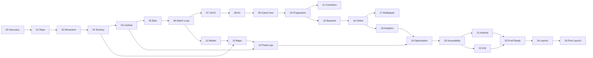

# Dependências entre fases

> Antes de executar qualquer fase, validar esta tabela. Se uma dependência não estiver
> satisfeita, **parar e reportar** — não improvisar um substituto.

## Grafo

## Tabela

| Fase | Depende de | O que exige, concretamente |
|---|---|---|
| 01 | 00 | ADRs 0001–0014 aceitos; docs de arquitetura escritos |
| 02 | 01 | Projeto Godot rodando; CI verde; GUT instalado; `ConfigService` carregando `.tres` |
| 03 | 02 | Runner se movendo com posição contínua; tick fixo de 60 Hz funcionando; câmera |
| 04 | 03 | `TerritoryGrid` e `SealSolver` completos e testados; Arc rasterizado 4-conectado |
| 05 | 04 | Break, Backwash, respawn e território liberado na morte funcionando |
| 06 | 05 | Bots jogando partidas completas sem travar; invariantes verdes em 500 partidas |
| 07 | 06 | Ciclo de partida completo com resultado e restart; eventos de score emitidos |
| 08 | 07 | Design system com tokens; todas as telas existindo (mesmo feias) |
| 09 | 08 | Paleta, shaders e assets finais aplicados; zero placeholder de arte |
| 10 | 09 | Save funcionando; eventos de fim de partida com dados completos |
| 11 | 10 | Perfil, inventário e moeda existindo; loja de seleção navegável |
| 12 | 06 | `MatchRulesResource` desacoplado; nenhuma regra de modo hardcoded |
| 13 | 03, 12 | Arena como dado (`ArenaDefinition`), com células bloqueadas suportadas |
| 14 | 04, 13 | `StatBlock` com modificadores empilháveis; spawn de itens no Field |
| 15 | 10 | Contratos de repositório estáveis; formato de save definido |
| 16 | 15 | API no ar com auth, leaderboard, save e config; contratos testados |
| 17 | 16 | Simulação determinística comprovada; API capaz de orquestrar instâncias |
| 18 | 16 | `AnalyticsService` com adapter remoto possível; endpoint de telemetria |
| 19 | 14, 18 | Todas as features de gameplay prontas; métricas reais de dispositivo |
| 20 | 19 | Performance dentro do orçamento; presets de qualidade funcionando |
| 21 | 20 | Build de release limpa, sem debug tools, sem placeholder |
| 22 | 20 | Idem, mais macOS com Xcode disponível |
| 23 | 21, 22 | Ambas as builds validadas em dispositivo real |
| 24 | 23 | Checklist de release fechado; rollback ensaiado |
| 25 | 24 | Jogo publicado e analytics recebendo dados reais |

## Dependências externas (fora do código)

| Item | Necessário em | Dono | Status |
|---|---|---|---|
| Conta Google Play Console (US$ 25) | GSD 21 | humano | ⬜ pendente |
| Conta Apple Developer (US$ 99/ano) | GSD 22 | humano | ⬜ pendente |
| macOS com Xcode 15+ | GSD 22 | humano | ✅ disponível |
| Hospedagem da API (Postgres + Redis) | GSD 15 | humano | ⬜ pendente |
| Domínio + certificado | GSD 15 | humano | ⬜ pendente |
| Busca de anterioridade da marca "VOLTA" | antes da GSD 21 | humano | ⬜ pendente (RISK-012) |
| Aparelho Android intermediário para testes | GSD 02 em diante | humano | ⬜ verificar |
| Fonte licenciada para uso comercial | GSD 08 | humano | ⬜ pendente |

Nenhuma delas bloqueia a GSD 01.

## Regras

1. Fase sem dependência satisfeita **não começa**.
2. Dependência "quase pronta" é dependência não satisfeita.
3. Se uma fase revelar uma dependência não mapeada, esta tabela é atualizada **no mesmo PR**.
4. Fases fora do caminho crítico (13, 17) podem ser adiadas sem bloquear o release — desde que
   registrado em `STATUS.md`.
