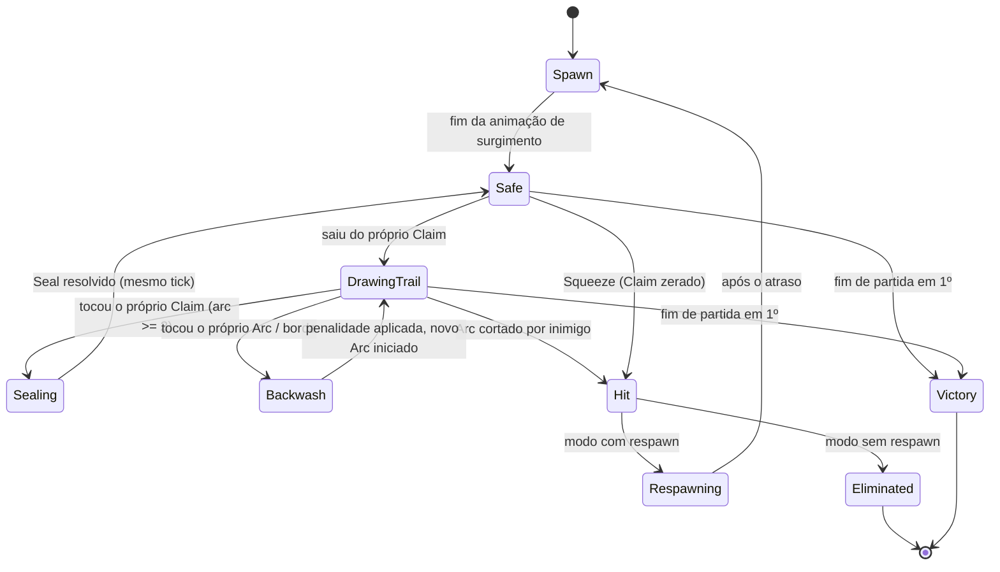
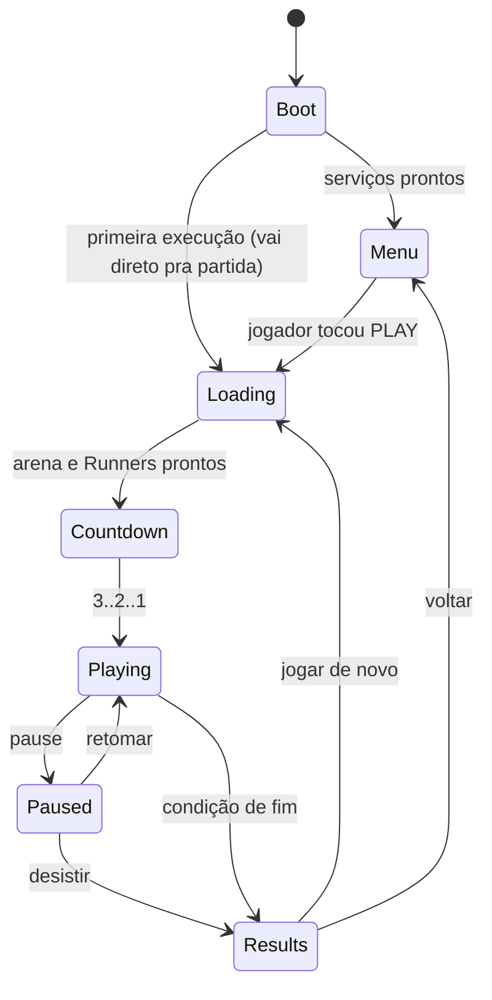

# Máquinas de estado

> Estados explícitos, transições nomeadas, uma tabela de transições válidas. Nada de
> `if is_dead and not capturing and has_trail and ...` — a humanidade já sofreu o bastante.

Implementação: `core/fsm/` com `StateMachine` genérica e tipada. Cada estado é uma classe com
`enter()`, `tick(delta)`, `exit()`. Transição inválida **quebra o jogo em debug** (assert) e é
logada e ignorada em release.

---

## 1. FSM do Runner



### Tabela de transições

| De | Para | Gatilho | Efeitos |
|---|---|---|---|
| `Spawn` | `Safe` | animação concluída | invulnerabilidade ligada |
| `Safe` | `DrawingTrail` | célula atual não é do próprio Claim | invulnerabilidade cai, Arc inicia, música sobe |
| `DrawingTrail` | `Sealing` | célula atual é do próprio Claim, `arc_len ≥ 2` | resolve Seal no mesmo tick |
| `DrawingTrail` | `Backwash` | célula atual tem Arc próprio, ou colisão com barreira | Arc apagado, Surge zerado, penalidade de velocidade |
| `DrawingTrail` | `Hit` | outro Runner entrou no meu Arc | crédito de Break ao agressor |
| `Backwash` | `DrawingTrail` | imediato (mesmo tick) | novo Arc inicia na posição atual |
| `Sealing` | `Safe` | imediato (mesmo tick) | eventos de captura, VFX, score |
| `Safe` | `Hit` | `claim_count == 0` | Squeeze |
| `Hit` | `Respawning` | modo com respawn | Claim vira neutro, câmera reage |
| `Hit` | `Eliminated` | modo sem respawn | fim de partida para esse Runner |
| `Respawning` | `Spawn` | fim do atraso | escolhe local de spawn válido |
| `*` | `Victory` | partida terminou com este Runner em 1º | trava input, roda celebração |

**Estados só de apresentação** (`Sealing`, `Backwash`, `Hit`) duram um tick de simulação. A
animação correspondente roda em paralelo, **sem** travar o controle (Pilar 2).

### Invariantes

- Só existe Arc nos estados `DrawingTrail`, `Backwash` e no tick de `Sealing`.
- Em `Safe`, `arc_length == 0` — sempre. Verificado por assert em debug.
- Invulnerabilidade só em `Spawn` e nos primeiros instantes de `Safe`, nunca em `DrawingTrail`.
- Nenhum estado dura mais de um tick sem uma condição de saída explícita e testável.

---

## 2. FSM do jogo



| Estado | Entra quando | Responsabilidade |
|---|---|---|
| `Boot` | app abre | carregar config, save, serviços; splash; **sem lógica de jogo** |
| `Menu` | serviços prontos | navegação, preview do Runner, desafios, loja |
| `Loading` | play | montar arena, grid, Runners, bots; pré-aquecer pools |
| `Countdown` | tudo pronto | 3 s; input já é lido (o jogador pode se preparar) |
| `Playing` | countdown zera | simulação rodando |
| `Paused` | pause | **congela tudo**: simulação, timers, áudio, partículas |
| `Results` | fim | score, XP, desafios, botão PLAY AGAIN em destaque |

Regras:
- `Boot` nunca depende de rede. Falha de rede não pode segurar a inicialização.
- Primeira execução pula `Menu` e vai direto para partida (ver `design/onboarding.md`).
- `Paused` congela o `_physics_process` inteiro. Nada expira em background (E12).
- `Results → Loading` não passa por `Menu`: reiniciar é **um toque**.

---

## 3. Implementação

```gdscript
class_name StateMachine
signal state_changed(from: int, to: int)

func add_state(id: int, state: State) -> void
func add_transition(from: int, to: int) -> void
func request(to: int) -> bool     # false + assert em debug se a transição não existir
func tick(delta: float) -> void
func current() -> int
```

- Transições são **declaradas na construção**, não espalhadas pelos estados.
- Estados não conhecem uns aos outros: eles pedem transição por id, a máquina valida.
- Toda transição emite `state_changed` — é daí que a apresentação se alimenta, sem poluir a
  simulação com chamadas de VFX.
- Cobertura de teste obrigatória: toda transição da tabela + rejeição de pelo menos 5
  transições inválidas (GSD 02/04).
