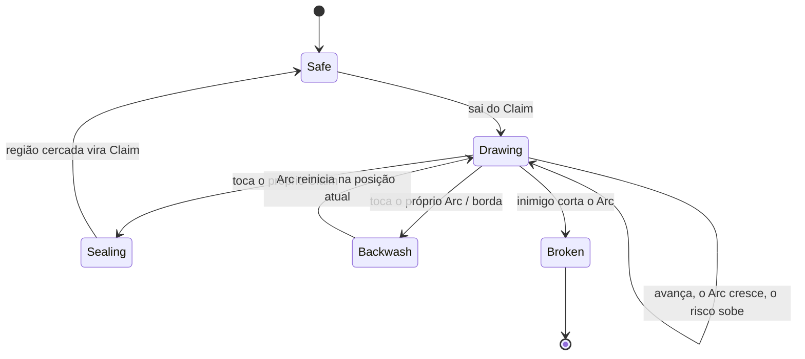

# Core loop

VOLTA tem três loops encaixados. Se qualquer um deles quebrar, o jogo não segura o jogador.

---

## Loop de 10 segundos — "sair e voltar"



O jogador faz essa decisão dezenas de vezes por partida:

> *"Fecho agora com 3 % garantidos, ou estico mais e tento 9 % com o dobro de risco?"*

É a única pergunta que o jogo precisa fazer bem. Tudo mais serve a ela.

**O que sustenta a tensão:**

| Elemento | Efeito |
|---|---|
| Multiplicador de risco na HUD | mostra em tempo real quanto vale continuar (1,0× → 2,5×) |
| Arc pulsando mais forte conforme cresce | o perigo é sentido, não lido |
| Aviso periférico de ameaça | seta na borda da tela quando um inimigo se aproxima do Arc |
| Música subindo de camada | tensão sonora acompanha o comprimento do Arc |

---

## Loop de 3 minutos — "a partida"

```text
Countdown 3s
   ↓
Primeiros 20s   expansão barata: mapa vazio, capturas seguras, todo mundo cresce
   ↓
30s – 90s       as fronteiras se tocam: começa a disputa. Roubar > expandir.
   ↓
90s – 150s      território consolidado; Breaks decidem. Surge alto vira snowball.
   ↓
Últimos 30s     "Final Push": pontuação de Seal recebe +25 %; todo mundo arrisca.
   ↓
Resultado       score, colocação, XP, Sparks, desafios cumpridos
   ↓
Restart em 1 toque (o botão principal da tela de resultado é PLAY AGAIN)
```

A curva é desenhada para que o **meio** da partida seja o pico de tensão e o **fim** seja
explosivo. O botão de reinício está sempre a um toque, sem tela intermediária, sem anúncio.

---

## Loop de 3 semanas — "por que voltar amanhã"

```text
Partida  →  XP + Sparks  →  Rank sobe  →  desbloqueio cosmético
   ↑                                              │
   └──────  desafios diários / semanais  ←────────┘
                     │
              leaderboard e recordes pessoais
```

- **Desafios diários** (3/dia, rerolláveis 1×) dão objetivo a quem não quer só "jogar mais".
- **Ranks** dão progresso garantido mesmo em partidas ruins (XP por sobrevivência e captura,
  não só por vitória).
- **Cosméticos** dão o motivo de longo prazo, sem tocar no balanceamento.
- **Leaderboards** (diário/semanal/mensal/geral/amigos) dão o teto competitivo.

---

## Primeira sessão (o loop mais importante de todos)

| Tempo | O que acontece |
|---|---|
| 0 s | Abre direto numa partida contra 2 bots fáceis. Sem menu, sem logo interminável. |
| 2 s | Dica única: **"Deslize para mover"**. Some assim que o jogador desliza. |
| ~6 s | **"Saia do seu território"**. Some quando o Arc começa. |
| ~12 s | **"Volte para capturar"**. Some no primeiro Seal — com celebração exagerada de propósito. |
| ~40 s | **"Corte o arco inimigo"** aparece só quando um bot estiver desenhando perto. |
| ~90 s | Fim da partida, resultado, primeiro Rank. Aí sim o menu aparece. |

Meta dura: **80 % dos jogadores novos realizam o primeiro Seal em menos de 25 segundos**,
sem ajuda externa. Isso é testado com gente de fora no gate da Alpha.
Detalhes em [`../design/onboarding.md`](../design/onboarding.md).
