# Roadmap

Quatro marcos. Cada marco fecha um conjunto de fases GSD e tem critérios verificáveis.
Nenhuma data está prometida — o gate é qualidade, não calendário.

```mermaid
gantt
    title VOLTA — marcos por fase GSD
    dateFormat X
    axisFormat %s
    section Fundação
    GSD 00 Discovery            :done, d0, 0, 1
    GSD 01 Repo Foundation      :active, d1, 1, 2
    section MVP
    GSD 02 Core Movement        :m1, 2, 1
    GSD 03 Territory Engine     :crit, m2, 3, 2
    GSD 04 Combat               :m3, 5, 1
    GSD 05 Bot AI               :m4, 6, 2
    GSD 06 Match Loop           :milestone, m5, 8, 1
    section Alpha
    GSD 07 UI/UX                :a1, 9, 2
    GSD 08 Art Direction        :a2, 11, 2
    GSD 09 Game Feel            :a3, 13, 1
    GSD 10 Progression          :a4, 14, 1
    GSD 11 Cosmetics            :a5, 15, 1
    GSD 12 Game Modes           :a6, 16, 1
    GSD 13 Maps                 :a7, 17, 1
    GSD 14 Power-ups            :milestone, a8, 18, 1
    section Beta
    GSD 15 Backend              :b1, 19, 2
    GSD 16 Online Services      :b2, 21, 1
    GSD 17 Multiplayer Arch     :b3, 22, 2
    GSD 18 Analytics            :b4, 24, 1
    GSD 19 Optimization         :b5, 25, 1
    GSD 20 Accessibility        :milestone, b6, 26, 1
    section Release
    GSD 21 Android              :r1, 27, 1
    GSD 22 iOS                  :r2, 28, 1
    GSD 23 Production Readiness :r3, 29, 1
    GSD 24 Launch               :milestone, r4, 30, 1
    GSD 25 Post Launch          :r5, 31, 2
```

---

## Marco 1 — MVP (fecha ao fim da GSD 06)

**Definição:** existe um jogo completo, jogável do início ao fim, feio.

| Critério | Verificação |
|---|---|
| O jogo inicia e chega a uma partida | teste manual + smoke test headless |
| O Runner se move com fluidez por swipe | `docs/gameplay/controls.md` + teste de latência |
| O Arc é desenhado ao sair do Claim | teste de integração `arc_starts_on_exit` |
| Fechar a volta captura a região | 12 testes unitários de `SealSolver` |
| Bots existem e jogam partidas inteiras | 500 partidas headless sem crash |
| Cortar Arc elimina | teste de integração `break_on_arc_hit` |
| Partida termina, mostra score e reinicia | teste de ciclo de vida |
| 60 FPS estáveis no aparelho-alvo | profiling em dispositivo médio |
| Zero bug crítico aberto | `.gsd/BACKLOG.md` |

**Aceita-se no MVP:** placeholders visuais (rastreados), som ausente, uma única arena, um
único modo (Classic), sem progressão, sem menu bonito.

---

## Marco 2 — Alpha (fecha ao fim da GSD 14)

**Definição:** parece um produto. Dá para colocar na mão de alguém de fora.

Adiciona ao MVP: UI completa e responsiva, direção de arte aplicada (zero placeholder),
game feel completo (VFX, SFX, háptico, câmera), progressão (XP, ranks, conquistas, desafios),
cosméticos, os 5 modos, 5 arenas, power-ups balanceados, save confiável com migração,
onboarding dentro do jogo.

Gate extra: sessão de playtest com ≥ 5 pessoas de fora, sem instruções verbais. ≥ 80 % devem
executar o primeiro Seal em menos de 25 segundos sem ajuda.

---

## Marco 3 — Beta (fecha ao fim da GSD 20)

**Definição:** pronto para teste aberto.

Adiciona: backend (auth, perfil, leaderboard, cloud save, remote config), desafios diários
online, analytics e crash reporting, otimização com profiling completo, acessibilidade,
matriz de dispositivos validada, arquitetura de multiplayer provada em protótipo.

Gate extra: crash-free sessions ≥ 99 % em build de teste fechado com ≥ 30 aparelhos distintos.

---

## Marco 4 — Release `v0.1.0` (fecha ao fim da GSD 24)

**Definição:** publicável.

| Critério | |
|---|---|
| 0 bugs blocker, 0 críticos | ✅ obrigatório |
| Crash-free sessions ≥ 99,5 % | ✅ |
| Migração de save validada de todas as versões anteriores | ✅ |
| Build Android (AAB) assinado e validado | ✅ |
| Build iOS validado no TestFlight | ✅ |
| 60 FPS no aparelho-alvo, 120 FPS onde disponível | ✅ |
| Documentação de privacidade pronta (Data Safety + Nutrition Label) | ✅ |
| Assets de loja prontos | ✅ |
| Analytics validado ponta a ponta | ✅ |
| Plano de rollback documentado e ensaiado | ✅ |

Depois de `v0.1.0`, **GSD 25** abre o ciclo de live ops: balanceamento por dados, temporadas,
arenas, skins, modos e eventos.

---

## Política de versão

- O projeto **começa em `v0.1.0`**. Não existe `v1.0.0` no lançamento.
- `v1.0.0` fica reservado para maturidade em produção com base de usuários relevante.
- `minor` para features (`v0.2.0`), `patch` para correções (`v0.1.1`).
- Fechar versão = bump em `project.godot` + `CHANGELOG.md` + tag anotada.
