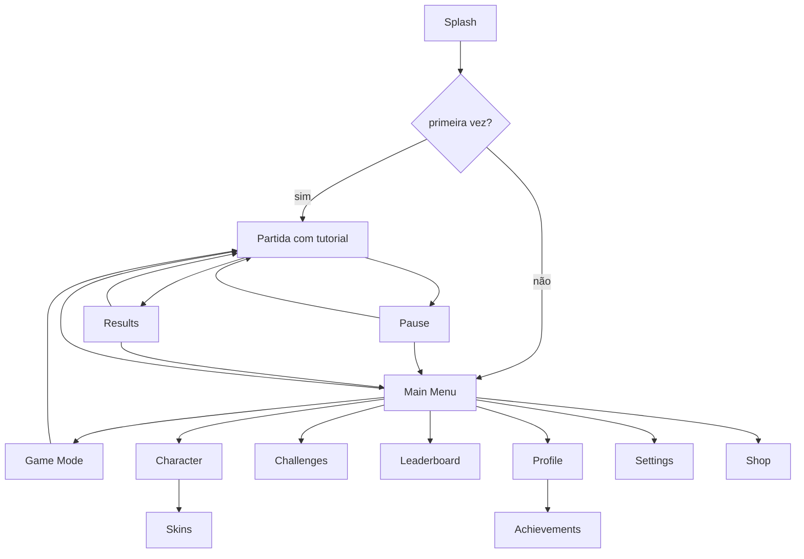

# Telas

Mapa de navegação, responsabilidade e conteúdo de cada tela. Implementação em **GSD 07**
(estrutura e navegação) e **GSD 08** (aparência final).



| Tela | Responsabilidade | Elementos | Fase |
|---|---|---|---|
| **Splash** | boot, carga de serviços | logo animado, barra sutil; **máx. 1,5 s** | 07 |
| **Main Menu** | primeira impressão + PLAY | logo, **PLAY dominante**, preview do Runner, moedas, nível+XP, atalho de desafios, engrenagem | 07 |
| **Game Mode** | escolher modo | cartão por modo com nome, tempo típico, ícone, recorde pessoal | 12 |
| **Play (partida)** | o jogo | HUD (ver `hud.md`), botão de pause | 06 |
| **Pause** | pausar sem perder o fio | Retomar (dominante), Reiniciar, Configurações, Sair; simulação congelada | 07 |
| **Results** | fechar o loop e recomeçar | colocação, % de território, score com contagem animada, bônus, XP ganho, Sparks, desafios cumpridos, **PLAY AGAIN dominante** | 06/07 |
| **Character** | identidade | preview grande, skin, Arc, efeito de Seal, título | 11 |
| **Skins** | coleção | grade com estados possuído/bloqueado/equipado, preço, filtro por raridade | 11 |
| **Challenges** | objetivo diário | 3 diários + 3 semanais, progresso, recompensa, reroll | 10 |
| **Leaderboard** | competição | abas Diário/Semanal/Mensal/Geral/Amigos, sua posição fixada no rodapé | 16 |
| **Profile** | identidade e histórico | avatar, título, nível, estatísticas, recordes, conquistas | 10 |
| **Achievements** | metas de longo prazo | lista com progresso, agrupada por família | 10 |
| **Settings** | controle | Áudio, Controles (com test drive), Gráficos, Háptico, Acessibilidade, Idioma, Conta, Privacidade, Sobre | 07 |
| **Shop** | cosméticos | destaques, categorias, preços claros, sem contagem regressiva falsa | 25 |

## Regras de navegação

- **Profundidade máxima 2** a partir do menu. Nada enterrado em três níveis.
- Back físico (Android) e gesto (iOS) fazem sempre a coisa óbvia; na raiz, pedem confirmação.
- Toda transição custa 250 ms e nunca bloqueia o toque.
- `Results → Play` é **um toque**, sem passar pelo menu, sem anúncio.
- Nenhuma tela carrega mais de 300 ms sem mostrar algo.
- Estado da tela sobrevive a `pause/resume` do sistema.

## Main Menu — hierarquia visual

```text
┌──────────────────────────┐
│  ✦ 2.480      ◈ 40    ⚙ │   moedas e configurações (topo, discretos)
│                          │
│         V O L T A        │   logo
│                          │
│      [preview animado]   │   Runner com skin equipada, desenhando um Arc em loop
│                          │
│   Rank 12 ▓▓▓▓▓▓░░ 68%   │   progresso do rank
│                          │
│      ┌────────────┐      │
│      │    PLAY    │      │   ação dominante — maior elemento tocável da tela
│      └────────────┘      │
│   [Modo]  [Desafios 2/3] │   secundários
│  Perfil  Skins  Ranking  │   navegação terciária
└──────────────────────────┘
```

O botão PLAY é o maior alvo de toque da tela e fica na zona confortável do polegar. Nenhum
elemento pode competir com ele em contraste ou tamanho.
